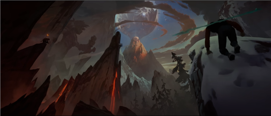

# [목차]
### 0. [게임명](#게임명--rise---1988024-성규민)
### 1. [컨셉](#컨셉)
### 2. [관련 이미지와 동영상](#관련-이미지--동영상)
### 3. [컨셉 & 대표이미지 기반 작품묘사](#컨셉--대표이미지-기반-작품묘사)
### 4. [RISE의 구성요소](#rise의-구성요소)
### 5. [게임 시스템 디자인](#게임-시스템-디자인)
### 6. [요구사항](#개발요구사항흐름도)
### 7. [스토리보드](#스토리보드)
### 8. [개발 일지](#개발-일지)
  > ### 8-1. 1주차(#1주차)
  > ### 8-2. 2주차(#2주차)
  > ### 8-3. 3주차(#3주차)
  > ### 8-4. 4주차(#4주차)
  > ### 8-5. 5주차(#5주차)
  > ### 8-6. 6주차(#6주차)
 

---------------------------------------  
 

# [게임명 : RISE] - (1988024 성규민)
> - Rise : 동사 (높은 위치·수준 등으로) 오르다, 올라가다[오다] (출처 : 네이버 어학사전)   
> - 게임의 모든 것을 의미하는 함축적인 단어로 오르다, 올라가다는 뜻의 Rise란 단어를 기용하였음   
> - 게임의 메인 오마주가 되는 영상(노래)의 제목이기도 함   
 

---------------------------------------  
 

# [컨셉]
>## 메인컨셉 : 등반
>- 플레이어는 게임 내내 위로 올라가는 등반을 하게 되며, 목표에 도달하기 위해서는 어떠한 꼼수도 없이 오직 오르는 것, 등반 만을 수행해야 한다.

>### 서브 컨셉 1 : 고난
>- RISE에서의 등반은 잘 깔린 등산로를 걸어오르는 것이 아닌 공중에 떠있는 돌들을 점프하여 지나간다거나, 벽에 아슬아슬하게 자라있는 나무들을 뛰어넘어가는 등의 장애물을 넘어가야 하는 고난의 길을 가야 한다.
>- 게임에서는 저장도, 안전한 공간도 없다. 떨어졌다면 다시 고난의 길을 올라야 할 것이다.

>### 서브 컨셉 2 : 도전정신
>- 단순히 목표물을 향해 달려가기만 하는 것은 게임이 아니다. 플레이어는 여러 고난들 - 함정, 통과하기 어려운 길 등에서 오는 난이도에 의해 도전 정신을 불태우고 이를 통과함에 의해 성취감을 얻을 수 있을 것이다.

>### 서브 컨셉 3 : 성취감
>- 위에서 설명하였듯이 플레이어는 자신을 가로막는 여러 고난들을 통해 이것들을 뛰어넘어 클리어하고 말겠다는 도전 정신을 발휘하게 될 것이다.
>- 이 도전정신을 통해 결국 목표에 도달한다면 큰 성취감을 얻을 것이다.

>### 서브 컨셉 4 : 오마주
>- 아무런 디자인 컨셉이 없이 기본 제공되는 Cube, Sphere 등 만을 사용해서는 좋은 디자인이 되지 못한다.
>- 디자인의 컨셉을 인지도가 있는 특정 매체에서 오마주해 친숙함과 디자인의 일관성, 퀄리티를 올린다.

>### 서브 컨셉 5 : 공유
>- 플레이어가 이 게임을 클리어 하였든, 클리어하지 못했든 이 게임을 플레이하며 여러 고난들을 통해 스트레스를 느끼기도 하였을 것이고, 클리어하여 성취감을 느끼기도 하였을 것이다.
>- 이러한 감정들을 타인에게도 느끼게 하고싶은, 지인에게 추천하여 플레이하게 하고 싶은 마음이 생기게 하는 것이 목표이다.    
 

---------------------------------------  
 

# [관련 이미지 & 동영상]

**컨셉 이미지**   

   

 

# [대표 이미지]

   
 

# [컨셉 & 대표이미지 기반 작품묘사]
> ### 컨셉 기반
>- 컨셉이미지의 1번 이미지는 성경에 나오는 바벨탑의 이미지이다. 게임의 1장의 배경이 되는 하늘까지 솟은 탑의 이미지와 유사한 형태를 띄고 있다.
>- 컨셉이미지의 2번 이미지는 그리스로마신화에 나오는 올림포스 신전의 이미지이다. 게임의 2장의 배경이 되는 하늘 위의 산과 그 정상에 있는 목표가 있는 신전의 이미지와 유사한 형태를 띄고 있다.
 

> ### 대표이미지 기반
>- 대표 이미지에선 여러 장애물이 시각적으로 보이며, 플레이어는 정상을 향해 올라가는 과정에서 이 장애물들을 넘어가야 한다. 화면 상단에는 플레이어가 얼마나 올라왔는지, 그리고 떨어질 때 얼마나 떨어지는지도 시각적으로 알 수 있는 현재 높이를 표시하는 UI가 존재하며, 우상단에는 플레이어가 이 게임을 얼마나 플레이하였는지 알 수 있는 플레이타임 UI가 존재한다.

---------------------------------------  
 

# [RISE의 구성요소]
- “무수한 장애물을 넘어 끝없이 도전하며 정상에 올라라“
 

>## 1. 메커니즘

>__[도전 과제]__
>- 수단과 방법을 가리지 않고 가로막는 것들을 넘어 목표에 도달하라
>
>__[재미 요소]__
>- 끝없는 도전에서 나오는 오기, 클리어에서 나오는 해방감
>- 플레이하는 본인 뿐만이 아닌 지켜보는 사람이 더 재밌는 게임

 

>## 2. 이야기
>__[만들게 된 배경]__
>- 과거 스트리머들 사이에서 유행하던 항아리게임, 골프공게임 같은 극한의 난이도와 한번에 실수에서 나오는 끝없는 추락, 플레이하는 사람이 고통받지만 그걸 보는 사람 입장에서는 재밌는, 남의 고통은 나의 행복 같은 게임을 만들고 싶었다.
>
>__[카메라 관점]__ 
>- 3인칭 후상단 내려다보는 시점의 카메라
 

>## 3. 미적요소
>__[디자인]__
>- 캐릭터 디자인 : 오마주 영상의 주인공과 비슷한, 간결한 옷차림에 후드를 쓴 모습의 성인 남성 주인공
>- 1장 디자인 : 바벨탑에 맞는 주로 석재로 이루어진 디자인, 중세시대 느낌
>- 2장 디자인 : 올림포스 산 같은 느낌, 자연 관련 요소 및 디자인, 그리스/로마풍 컨셉
>
>__[음향]__
>- 1장 BGM : 간간히 들려오는 조용하지만, 결코 가볍지는 않은 BGM
>- 2장 BGM : 볼륨이 크진 않지만 확실히 알아들을 수 있는 웅장한 BGM, 끝에 가까워질수록 몰입도 증가
>- 음성 효과 : 플레이어 점프 시 효과음, 각종 함정에 알맞은 효과음 적용, 각종 UI 버튼에 효과음 재생
 

>## 4. 기술
>- 대중적인 PC에서 플레이가 가능한 정도의 수준으로 개발
>    
> (출처 : GTA5 시스템 최소/권장 요구사항)
 

---------------------------------------  
 

# [게임 시스템 디자인]
## 1. 게임 오브젝트 분해

|번호|이름|이미지|  
|:---:|:---:|:---:|  
| 1 | Player |  |
| 2 | Target |  |
| 3 | floatingBoard |  |
| 4 | Tree |  |
| 5 | Ladder |  |
| 6 | jumpPad |  |
| 7 | obstacle | 정형화된 장애물이 아닌 점프구간 등의통칭이므로 정해진 이미지가 없음 |
| 8 | sewerPipe |  |
| 9 | fallingStone |  |
| 10 | icePlate |  |
| 11 | Spike |  |
| 12 | pendulumHammer |  |
| 13 | Pistone |  |
| 14 | windBlower |  |
| 15 | Lava |  |

   

## 2. 파라미터 분석
1) 오브젝트 이름 : player

|속성|영문명칭|설명|
|:---:|:---:|:---:|
| 이동속도 | moveSpeed | player의 이동속도 |
| 점프가능 | jumpAble | player가 점프를 실행할 수 있는가의 여부 조건 : 땅에 있는 상태인가 and 점프중이 아닌 상태인가 |
| 점프높이 | jumpPower | player가 점프를 실행할 때 얼마의 힘으로 점프하는가 |
| 상호작용 | interact | player가 상호작용이 가능한가의 여부 조건 : 상호작용 오브젝트의 collider와 player의 collider가 겹쳐있는가 |
| 기술획득여부 | isSkillAchived | 더블점프 기술을 획득하였는가의 여부 |
| 더블점프가능 | doubleJumpAble | 더블점프가 실행 가능한 가의 여부  조건 : 땅에 있는 상태가 아니고, 공중에 있는 상태이며, 마지막으로 땅에 있는 상태 이후 더블점프가 수행되지 않은 상태 |
 

2) 오브젝트 이름 : (기타장애물들)

|속성|영문명칭|설명|
|:---:|:---:|:---:|
| 점프패드쿨타임 | jumpPad_CT | jumpPad가 다시 작동할 때까지의 대기시간 |
| 스파이크쿨타임 | spike_CT | spike가 다시 튀어나올 때까지의 대기시간 |
| 진자망치속도 | hammer_speed | hammer가 움직이는 속도 |
| 피스톤쿨타임 | piston_CT | piston이 다시 작동할 때까지의 대기시간 |
| 송풍기쿨타임 | windBlower_CT | windBlower가 다시 작동할 때까지의 대기시간 |
 

## 3. 행동 뽑아보기

| 행동 | 영문명칭 | 설명 |
|:---:|:---:|:---:|
| 전진 | moveForward | W키를 눌러 moveSpeed의 속도로 앞으로 이동 |
| 후진 | moveBackward | S키를 눌러 moveSpeed의 속도로 뒤로 이동 |
| 좌로 이동 | moveLeft | A키를 눌러 moveSpeed의 속도로 좌로 이동 |
| 우로 이동 | moveRight | D키를 눌러 moveSpeed의 속도로 우로 이동 |
| 점프 | jump | Space키를 눌러 jumpPower만큼 위로 점프 |
| 상호작용 | interact | E키를 눌러 상호작용 가능한 오브젝트와 상호작용 |
| 더블점프 | doubleJump | 점프를 한 상태에서 공중에 있는 상태일 때 한번 더 점프를 수행함 |

 

## 4. 상태 뽑아보기
> 
 

## 5. 플레이어 파라미터
없음
 

## 6. 게임의 규칙
>- 핵심 규칙 
>플레이어는 단 하나의 목표만을 가진다. 수단과 방법을 가리지 않고 최종 도착점 목표에 도달하는 것. 
>플레이어는 자신의 컨트롤 실력만을 사용해 목표에 도달하는 것을 막는 수많은 장애물과 난관을 넘어야 한다. 
>대부분의 함정은 플레이어의 진행을 방해하여 떨어지거나, 진행하는 것을 어렵게 한다. 
>낙석, 진자 해머, 송풍기는 플레이어를 밀어내어 떨어지게 한다. 
>가시, 용암은 플레이어가 닿을 시, 사망 행동이 발생하며 스테이지의 세이브 포인트로 이동한다. 
>빙판은 플레이어가 미끄러지는 속성이 있어 이동을 어렵게 한다. 
>점프패드는 플레이어가 밟을 시 위로 높이 올려보낸다. 
>스테이지는 2개로 나뉘며, 스테이지 별 테마가 다르다.
> 

>- 보조 규칙 
>스테이지 1을 클리어 할 시, 세이브로 지정되어 스테이지 2에서 떨어지더라도 스테이지 2의 초기 시작점인 세이브로 돌아간다.
 

## 7.게임에서 사용될 공식
없음
 

---------------------------------------  
 

# [개발요구사항/흐름도]

## 1. 요구사항
## [게임 전체 흐름 요구사항]
>- A1. 시작화면, 게임화면 총 2개의 화면(씬)이 존재
>- A1-1. 시작화면에는 게임 시작, 이어 하기, 설정, 게임 종료 버튼이 존재
>
>- A2. 게임 시작 클릭 시 게임화면으로 이동
>
>- A3. 이어 하기 클릭 시 이전에 플레이하던 게임화면으로 이동
>
>- A4. 설정 화면에서는 게임의 각종 설정이 존재
>- A4-1. 음량 조절과 게임 종료 버튼이 있으며, 좌상단 X 버튼을 눌러 이전화면으로 복귀
>
>- A5. 게임화면에는 플레이 시간, 현재 높이가 상단에 표시
>
>- A6. 조작은 WASD로 전후좌우 이동, Space로 점프, Esc로 설정 화면 및 게임 종료 버튼 UI
>
>- A7. 게임의 종료 조건은 2장 마지막의 목표에 도달할 시
>
>- A8. 마지막 목표 도달 시, 애니메이션이 재생됨
>
>- A9. 애니메이션 종료 후, 플레이 시간과 높이, 클리어 횟수가 기록된 석판 UI가 나옴
>
>- A10. 돌아가기 버튼을 눌러 초기화면으로 복귀

## [6주 요구사항]
> ### B1. 공통 오브젝트
>- B1-1. ~~플레이어 - 후드를 쓴 모습의 남성캐릭터이다. Low-Poly 느낌의 LD 캐릭터 모델을 사용한다.~~
>- B1-1-1. ~~W A S D 키를 사용해 moveSpeed 만큼 자유롭게 이동가능하다. 단순 전후좌우 이동이 아닌 두 키의 조합을 통해 대각선으로도 이동이 가능하여야 한다.~~
>- B1-1-2. ~~Space 키를 사용해 jumpForce 만큼 점프할 수 있어야 한다. 이때, 공중에서 다시 점프를 할 수 없도록 플레이어가 땅에 붙어있을 때만 점프가 가능하도록 bool 자료형 isGrounded로 해당 여부를 판별한다. ~~
>- B1-1-3. ~~각각의 행동에 따라 적절한 애니메이션이 재생되어야 한다. 기본 애니메이션으로는 대기(Idle), 이동(Running), 점프(Jumping), 추락(Falling)이 존재한다.~~
>- B1-1-4. ~~카메라 시점은 플레이어의 후방 내려다보는 3인칭 시점이다. 마우스 조작을 통해 카메라가 회전하며, 플레이어또한 함께 회전한다.    ~~
>
>- B1-2. 사다리 - 플레이어가 타고 오를 수 있는 오브젝트이다. 플레이어가 해당 오브젝트에 붙어서 W키를 누르면 올라가고, S키를 누르면 내려간다.
>- B1-3. 부유석 - 플레이어가 점프하여 밟고 넘어갈 수 있는 공중에 떠있는 돌 - 정지상태인 부유석과 특정 범위를 왕복이동하는 부유석이 존재한다.

> ### B2. 1장에 존재하는 함정 오브젝트
>- B2-1. 점프패드, 하수도관, 진자망치, 피스톤, 송풍기
>- B2-1-1. ~~점프패드 - 플레이어가 밟으면 각 패드마다 정해진 jumpPadForce만큼 AddForce하여 플레이어를 위로 날려보낸다.~~
>- B2-1-2. ~~하수도관 - 점프맵용 오브젝트의 일부분으로, 전용 기능은 존재하지 않는다.~~
>- B2-1-3. 진자망치 - 각 오브젝트별로 정해진 범위만큼 swingSpeed의 속도로 왕복진자운동을 진행한다. 플레이어가 오브젝트에 맞으면 해당 이동방향으로 밀려난다.
>- B2-1-4. ~~피스톤 - 각 오브젝트별로 정해진 범위만큼, 정해진 시간마다 pistonSpeed 만큼 왕복운동을 진행한다. 밟고 넘어갈 수 있는 벽돌이 벽 속에서 이 피스톤으로 밀려나 튀어나왔다가 들어갔다가 하는 식으로 작동한다.~~
>- B2-1-5. 송풍기 - 각 오브젝트별로 정해진 시간마다 정해진 시간만큼 바람을 분다. 바람은 플레이어를 밀어낸다.    

> ### B3. 1장 구현
>- B3-1. 거대한 탑 (바벨탑을 모티브로)을 1장의 주 무대로 한다.
>- B3-1-1. 중세 분위기의 디자인 - 석재 및 목재 디자인으로 제작한다.
>- B3-1-2. 거대한 탑의 내부에서 외곽을 돌며 각종 함정을 피하고, 점프해서 넘어가며 위로 올라간다.
>- B3-1-3. 각종 함정을 유기적으로 배치한다. 피스톤으로 벽속에서 들어왔다 나갔다 하는 블럭이라던가, 점프패드를 통해서만 넘어갈 거리의 절벽에 송풍기가 달려있어 타이밍을 맞춰야만 넘어갈 수 있다는 등.

 

---------------------------------------  
 

## [차후 요구사항]

> ### B4. 2장에 존재하는 함정 오브젝트
>- B4-1. 나무, 낙석, 빙판, 용암
>- B4-1-1. 나무 - 점프맵용 오브젝트의 일부분으로, 전용 기능은 존재하지 않는다.
>- B4-1-2. 낙석 - 정해진 돌 프리팹 목록 중 무작위의 프리팹이 무작위로 굴러떨어진다. 플레이어가 충돌할 시 플레이어를 AddForce로 팅겨내며 밀어낸다.
>- B4-1-3. 빙판 - 플레이어가 해당 오브젝트 위에서 이동할 시 미끄러진다. 마찰력이 적기 때문에 특정 각도 이상의 오르막길에서는 미끄러져 내려간다.
>- B4-1-4. 용암 -

## [각 장별 흐름]
### C1. 1장

### C2. 2장

### C3. 목표
 

## 2. 시간별 흐름도 flowchart
> 
 

## 3. 키보드 이벤트에 대한 흐름도
> 
 

## 4. 용어정리
> 
 

---------------------------------------  
 

# [스토리보드]
> ## 1)
>   
>- 1장의 거대한 탑을 올려다보는 플레이어. 정상에 올라 전설이 되겠다는 각오. 
  

> ## 2)
>   
>- 탑을 오르며 각종 함정들을 넘고 점프해가며 등반하는 모습
  

> ## 3)
>   
>- 탑의 정상의 문을 열고 위대한 산의 시작점에서 목표를 바라보는 모습 
  

> ## 4)
>   
>- 탑을 오를 때와 마찬가지로 각종 고난을 넘으며 등반하는 모습
  

> ## 5)
>   
>- 탑을 오를 때와 마찬가지로 각종 고난을 넘으며 등반하는 모습
  

> ## 6)
>   
>- 최후의 신전에 자신의 위업이 기록되는 모습(게임 마지막 애니메이션)

 

---------------------------------------  
 

## [개발 일지]
> ## 1주차)
> ### 작업명 : 플레이어 제작 
> ### 해당 요구사항 :
> 1) 플레이어 모델 구하기  
> 2) 플레이어 기본 이동 기능 구현(전후좌우 이동, 점프)  
> 3) 플레이어 애니메이션 제작 및 적용  
 

> ### 작업 내용 :
> 1) Asset Store에서 플레이어 모델을 얻음(임시 플레이어 모델로 추후 변경될 예정)  
> 2) 플레이어의 기본 이동 기능 (W A S D 이동, Space 점프) 구현  
> 3) Mixamo 사이트에서 애니메이션을 제작하여 각 행동에 맞게 실행되도록 적용  
 

> ## 2주차)
> ### 작업명 : 각종 장애물 제작 1 (B2)
>  

> ### 해당 요구사항 :  
> 1) 점프패드 (B2-1-1) - 90% 
> 2) 하수도관 (B2-1-2) - 70% 
> 3) 진자망치 (B2-1-3) - 70% 
> 4) 피스톤 (B2-1-4) - 0% 
> 5) 송풍기 (B2-1-5) - 30% 
 

> ### 작업 내용 :  
> 1) 계획서의 이미지와 유사한 타입의 오브젝트 에셋을 구하여 밟으면 플레이어를 위로 날려보내는 점프패드 기능을 제작한다. 
>      ㄴ Asset Store에서 Teleporter 오브젝트를 구하여 텔레포터 기능을 제거한 후, OnTriggerEnter 함수를 사용해 오브젝트가 점프패드의 Collider에 들어왔을 경우, 해당 오브젝트의 이름에 "Player"가 포함되면 해당 오브젝트의 Rigidbody 컴포넌트를 불러와 AddForce 함수를 통해 위 방향으로 jumpPadForce만큼의 힘으로 올려보내게 제작하였다.  
> 2) 하수도관 에셋을 구하여 일자모양, 꺾인모양 등을 프리팹화하여 배치가 쉽도록 제작한다. L자형 하수도는 아직 제작하지 못하였다.  
> 3) 흔들리는 속도와 범위를 변수로 조정 가능한 스크립트를 작성한다.  
>      ㄴ public 변수로 Inspector에서 angle과 swingSpeed 변수값을 조정 가능하게 만들었다. 진자운동 함수는 Quaternion의 Lerp 함수를 통해 구현하였다.  
> 4) 특정 오브젝트를 이동시키는 피스톤 오브젝트를 제작한다  
> 5) 플레이어를 밀어낼 수 있는 바람 매커니즘과 해당 매커니즘을 ON/OFF 하는 송풍기를 제작한다. 
>      ㄴ Asset Store에서 송풍기 오브젝트는 구하였으나 플레이어를 밀어내는 바람 매커니즘을 구현하지 못하였음 
 

> ## 3주차)
> ### 작업명 : 1, 2주차 미완부분 보강 및 구현
>  

> ### 해당 요구사항 :
> B1-1-3. 각각의 행동에 따라 적절한 애니메이션이 재생되어야 한다. 기본 애니메이션으로는 대기(Idle), 이동(Running), 점프(Jumping), 추락(Falling)이 존재한다. 
>         └  점프 시 애니메이션이 간헐적으로 재생되지 않는 버그 수정, 추락 애니메이션 구현 - 100% 구현 완료 - 점프 버그는 Trainsition의 Setting에서 Interruption Source를 수정함으로서 해결  
> 
> B2-1-2. 하수도관 - 점프맵용 오브젝트의 일부분으로, 전용 기능은 존재하지 않는다. 
>         └  L자, T자 하수도 관 오브젝트 구현 - 100% 구현 완료  
> 
> B2-1-3. 진자망치 - 각 오브젝트별로 정해진 범위만큼 swingSpeed의 속도로 왕복진자운동을 진행한다. 플레이어가 오브젝트에 맞으면 해당 이동방향으로 밀려난다. 
>         └  진자 망치가 플레이어와 충돌 시 해당 방향으로 밀어내는 기능 구현 - 0% 구현  
> 
> B2-1-4. 피스톤 - 각 오브젝트별로 정해진 범위만큼, 정해진 시간마다 pistonSpeed 만큼 왕복운동을 진행한다. 밟고 넘어갈 수 있는 벽돌이 벽 속에서 이 피스톤으로 밀려나 튀어나왔다가 들어갔다가 하는 식으로 작동한다. 
>         └  피스톤 전체적으로 구현 - 80% 구현 완료 - 기능구현 완료, 오브젝트 세부 디테일 구현 필요  
> 
> B2-1-5. 송풍기 - 각 오브젝트별로 정해진 시간마다 정해진 시간만큼 바람을 분다. 바람은 플레이어를 밀어낸다. 
>         └  송풍기의 기능 구현 - 60% 구현 완료 - 플레이어 밀어내는 기능 구현 완료, 정해진 시간마다 작동하는 기능 미구현, 애니메이션 미구현, 이펙트 미구현  
  

> ## 4주차)
> ### 작업명 : 스테이지 1 기본 제작
> ### 해당 요구사항 :
> B4-1. 거대한 탑 
> B4-1-1. 중세 분위기의 디자인 - 석재 디자인. 
> B4-1-2. 거대한 탑에서 빙글빙글 돌며 점프하고 타고 올라간다. 
> B4-1-3. 각종 함정을 유기적으로 배치. 

> 이번 주는 개인 사정으로 시간이 부족하여 앞으로 사용될 에셋들을 찾고 정리하였음
  

> ## 5주차)
> ### 작업명 : 스테이지 1 기본 제작 / 스테이지 1 함정 완성
> 
> ### 해당 요구사항 : 
> 
> B2-1-3. 진자망치 - 각 오브젝트별로 정해진 범위만큼 swingSpeed의 속도로 왕복진자운동을 진행한다. 플레이어가 오브젝트에 맞으면 해당 이동방향으로 밀려난다. 
>         ㄴ플레이어 밀어내는 기능  
> B2-1-5. 송풍기 - 각 오브젝트별로 정해진 시간마다 정해진 시간만큼 바람을 분다. 바람은 플레이어를 밀어낸다. 
>         ㄴ정해진 시간마다 작동하는 메커니즘, 이펙트   
> B2-1-4. 피스톤 - 각 오브젝트별로 정해진 범위만큼, 정해진 시간마다 pistonSpeed 만큼 왕복운동을 진행한다. 밟고 넘어갈 수 있는 벽돌이 벽 속에서 이 피스톤으로 밀려나 튀어나왔다가 들어갔다가 하는 식으로 작동한다. 
>         ㄴ디자인  
> B4-1. 거대한 탑 
> B4-1-1. 중세 분위기의 디자인 - 석재 디자인. 
> B4-1-2. 거대한 탑에서 빙글빙글 돌며 점프하고 타고 올라간다. 
> B4-1-3. 각종 함정을 유기적으로 배치.  
> 
> ### 작업 결과 :
> 맵 Terrain 디자인 및 작업 
> 스테이지 1에 사용될 탑 맵 일부 기획 
> 피스톤 디자인 구현 
> 스테이지 1의 디자인에 어울리는 맵 요소 오브젝트 에셋 구하기 
  

> ## 6주차)
> ### 작업명 : 스테이지 1 제작

> ### 해당 요구사항 :
> B4-1. 거대한 탑 
> B4-1-1. 중세 분위기의 디자인 - 석재 디자인. 
> B4-1-2. 거대한 탑에서 빙글빙글 돌며 점프하고 타고 올라간다. 
> B4-1-3. 각종 함정을 유기적으로 배치. 
> 
> ### 작업 내용 :
> B4-1. 거대한 탑 - 80% 
> B4-1-1. 중세 분위기의 디자인 - 석재 디자인. 
> B4-1-2. 거대한 탑에서 빙글빙글 돌며 점프하고 타고 올라간다. 
> B4-1-3. 각종 함정을 유기적으로 배치. - 60%  
> 점프패드가 비활성화 상태일 때 이펙트 기능이 정지하는 기능 구현 
> 플레이어가 땅에 붙어있음을 확인하는 isGrounded 기능 수정(기존 Raycast / 수정 후 OnCollisionEnter) 
> 플레이어의 Collider 수정 (Capsule - > 다중 Box) 
> 플레이어 점프 애니메이션 변경 
> L자 하수도관 모델에 오류가 있던 점 수정 
> 송풍기 기능(방향) 오류 수정 
> UI 일부 수정 
  
